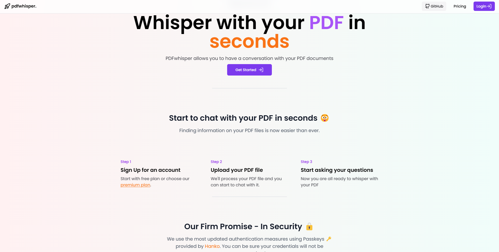
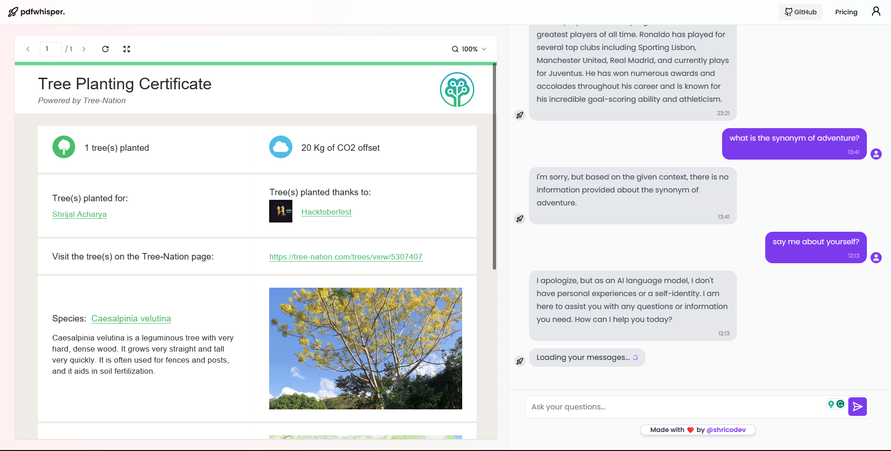
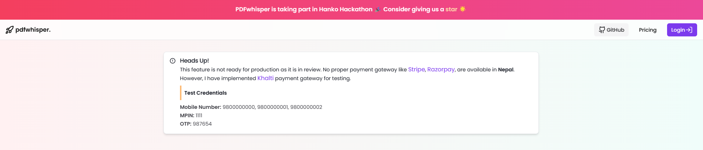
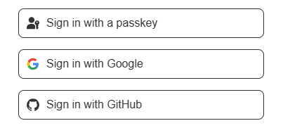

<h1 align="center">Welcome to PDFwhisper🚀 👋</h1>
<p>
  
  <a href="#" target="_blank">
    
  </a>
  <a href="https://twitter.com/shricodevv" target="_blank">
    
  </a>
</p>


> PDFwhisper allows you to have a conversation with your PDF docs. Finding info on your PDF files is now easier than ever.

### 🏠 [Visit Website](https://pdfwhisper-openai.vercel.app)

### ✨ [Demo](https://pdfwhisper-openai.vercel.app)







## Install - (Suggested)

> As this project uses free plan of **OpenAI**, it has limited access to the API. So, I suggest you to install it locally.

> 🔴 Make sure to populate all the `.env` variables before running the project as shown in `.env.example`. You can skip the env variables starting with `KHALTI_`

```sh
pnpm install
```

## Dev Usage

```sh
pnpm run dev
```

## Firm Promise - In Security 🔒

> We use [Hanko Passkey](https://hanko.auth) for authentication. The most modern and secure way to authenticate. You can be sure that your data is safe with us. ✅ Your data shall never be compromised.

The project currently supports **Google**, **Github** as our OAuth providers.



## Author

👤 **Shrijal Acharya @shricodev**

- Website: https://shricodev.tech
- Twitter: [@shricodevv](https://twitter.com/shricodevv)
- Github: [@shricodev](https://github.com/shricodev)
- LinkedIn: [@shrijal007](https://linkedin.com/in/shrijal007)

## 🤝 Contributing

Contributions, issues and feature requests are welcome!<br />Feel free to check [issues page](https://github.com/shricodev/pdfwhisper-openai/issues).

## Show your support

Give a ⭐️ if this project helped you!
